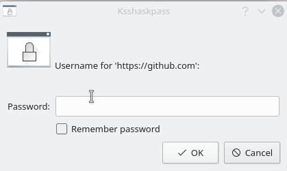
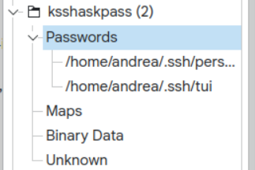

#  [Guide] ssh-agent + KWallet to store ssh private key passphrases

I finally managed to get a reliable ssh-agent configuration which stores passphrases of your private keys inside the KWallet so you don’t ever have to enter them again (for example when doing a git pull).

Since I had failed at the task several times, and you find plenty of different ways to do it on the Internet (some of which seemed a bit clunky and outdated), I decided to try and become yet another Google search result (hopefully useful to someone).

First of all, I assume that some pre-requisites are met. You got your key pairs generated and your private keys are passphrase-protected.

Your `~/.ssh/config` file should look something like this:

```
Host github.com
    IdentityFile ~/.ssh/personal
    AddKeysToAgent  yes

Host *.repo.borgbase.com
    IdentityFile ~/.ssh/personal
    AddKeysToAgent  yes

Host my.work.domain
    IdentityFile ~/.ssh/work
    AddKeysToAgent  yes
```

The important bit here is `AddKeysToAgent yes`

Also, you can (and should!) have different key pairs for different uses (I have a personal one and a work one, but you could even have one per domain).
Private key files can be called any way you like, you don’t have to necessarily call them id_25519 or whatever the default is. Just make sure your config file references valid private key files in the `IdentityFile` property

Next, set up ssh-agent so that it starts at boot. We will create a user systemd unit/service, called `ssh-agent.service`.

Create the folder to store the unit file:
`mkdir -p ~/.config/systemd/user`

Create the unit file with its content:

```
echo '[Unit]
Description=SSH key agent

[Service]
Type=simple
Environment=SSH_AUTH_SOCK=%t/ssh-agent.socket
ExecStart=/usr/bin/ssh-agent -D -a $SSH_AUTH_SOCK

[Install]
WantedBy=default.target' >> ~/.config/systemd/user/ssh-agent.service
```

This requires the `SSH_AUTH_SOCK` env variable to be set, so add it to your `~/.bash_profile` with this command:

```
echo '# For SSH agent systemd user unit
export SSH_AUTH_SOCK="$XDG_RUNTIME_DIR/ssh-agent.socket"' >> ~/.bash_profile
```

(note: this env var is also exported inside the systemd unit above - I couldn't figure out why, but it's needed in both places)

Enable the service we just created:

`systemctl --user enable --now ssh-agent.service`

Now confirm the service is running with:

`systemctl --user status ssh-agent.service`

And check identities known/cached by the ssh-agent:

`ssh-add -l`

It should say that no identites are known at the moment.

Now thanks to `AddKeysToAgent yes` mentioned earlier, as soon as you unlock a private key by entering its passphrase, the ssh agent will also remember the passphrase as long as it's running (which, unless it crashes, means for the current session).

You can confirm this with a `git pull`, enter your passphrase when prompted, then run again `ssh-add -l`, and this time you should see something like:

256 SHA256:your public key fingerprint your@mail.com (ED25519)

Now if you do the same `git pull` again, the ssh-agent will provide the passphrase for your private key, you won't have to enter it again.

With this fairly simple setup you should already solve the major annoyance of having to re-type your passphrase every time, you only have to type it once (for every key) per session. Nice!

Now let's take the final step, so that you only have a passphrase once, then store it in KWallet so that any subsequent passphrase request will be routed to and taken care of by KWallet.
This way, once your private key passphrases are securely stored in KWallet once, you won't ever need to type them again.

There is an extra pre-requisite here: KWallet should be properly configured to auto-unlock at login.

To my knowledge, this happens automatically provided that these two conditions are met:
- the wallet file is called `kdewallet`
- the wallet file is protected with a passphrase that matches your Linux user password, or it is NOT password protected at all
  - this allows KWallet to automatically unlock your wallet/vault at login. If this condition is not met, you will be greeted with a KWallet popup asking for its passphrase as soon as an app on your system tries to access secrets stored in your vault (which is a bit annoying)

If any of these conditions isn't met, I’d recommend to delete the wallet file and recreate one that meets them.
CAREFUL, backup/export all the secrets stored in your wallet before proceeding!

Now just to make the explanation more relatable, so far you have set up ssh-agent to auto-start, you have configured ssh to feed passphrases to such agent once at least one successful private key unlock has happened. What we are going to do is force the use of a different handler for collecting the passphrase from the user, when needed.

By default ssh uses standard input if the unlock attempt happened from the terminal, so we are going to force the use of a KDE UI instead.

The KDE UI part is crucial, because on top of showing an graphical input field, it also features a checkbox that allows to remember the entered passphrase and store it inside the KWallet, for more than just this session. Makes sense? Let’s go!

Run this command to append the two necessary lines to your `~/.bash_profile`:

```
echo 'export SSH_ASKPASS="/usr/libexec/ssh/ksshaskpass"
export SSH_ASKPASS_REQUIRE=prefer' >> ~/.bash_profile
```

N.B. the path to the `ksshaskpass` executable must be valid. As it can depend on the distro you are using, make sure to adapt the command to your environment.

The first line instructs ssh to use the KDE UI to fetch the user input/passphrase, the second one forces it to do so even if the private key unlocking attempt came from a terminal (i.e. not a graphical app)

You will probably need to log-out/log-in again, or even reboot, to make this change effective.

Once you are back in your session, you should see that:

`ssh-add -l`

says no identities known

If you do a `git pull` again, this time the passphrase should be requested via a UI popup (ksshaskpass)

The UI looks like this:



N.B. be sure to check the `Remember password` checkbox here!

Now you can verify that the ssh agent has your passphrase saved via:

`ssh-add -l`, and it should also appear in your `KWalletManager`:



If you try to `git pull` again, no passphrase will be requested, but we had already achieved this.

What's new is that now no passphrase will be requested even if you reboot or re-login, because the KDE Wallet will provide it from now on.

Enjoy!
